BStarTree
====================

This repository has a project with the implementation of a BStarTree.

It is written in C++.

The code of the BStarTree is independent of platform.

Is has two possible main files:

* [Codes](#markdown-header)
	* [A main that triggers unit test;](#markdown-header-emphasis)

	* [A Qt project to manage the BStarTree (With Gui).](#markdown-header-strikethrough)
	
The library used to make the Unit Test is the Catch v2.12.3. The code is already in this repository.

The Qt project generates images of the BStarTree, using the lib Graphviz.
Install this lib in your computer for you to be able to create such images.

The code was written containing the Doxygen documentation.

- - -

You have several options to build the project: 
====================

* [Build tools](#markdown-header)
	* [Makefile (using the file named MakefileGeneral);](#markdown-header-emphasis)
	* [CMake.](#markdown-header-emphasis)
	* [Qt Project (With QMake).](#markdown-header-emphasis)

The project has no leaks (Fully tested with Valgrind).

All the unit tests are ok.

- - -

The functionalities available are: 
====================

* [Functionalities](#markdown-header)
	* [Insert;](#markdown-header-emphasis)
	* [Search;](#markdown-header-emphasis)	
	* [Remove.](#markdown-header-emphasis)
	
- - -

Sample images: 
====================

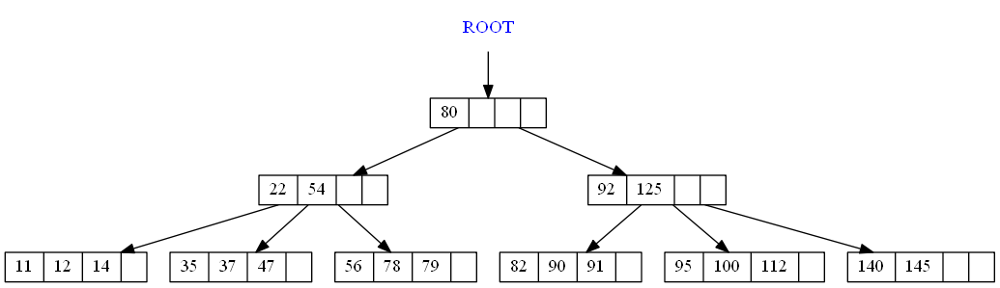

Qt gui project: 
====================
The qt gui application gui is shown below:

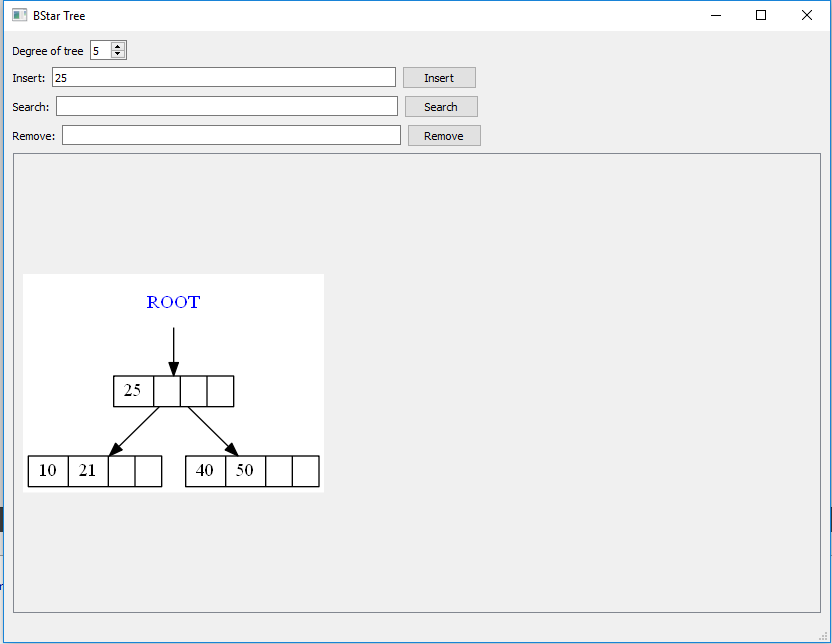

Insertion steps: 
====================

## Initial:

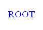

## Inserting 50:

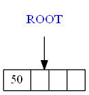

## Inserting 40:

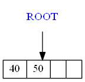

## Inserting 60:

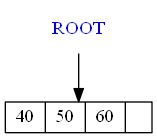

## Inserting 70:

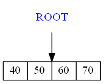

## Inserting 80:

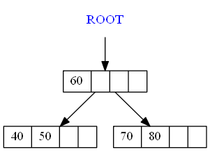

## Inserting 90:

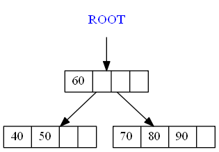

## Inserting 100:

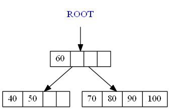

## Inserting 110:

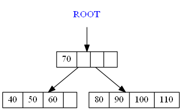

## Inserting 120:

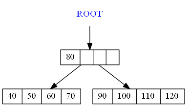

## Inserting 130:

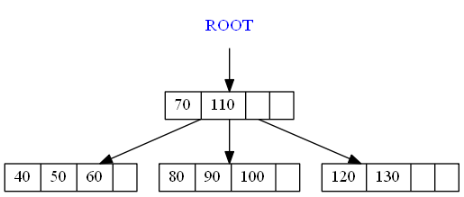

## Inserting 101:

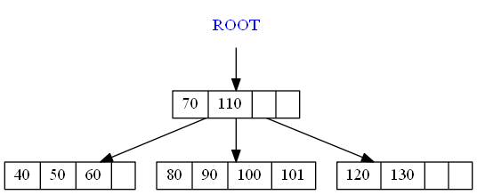

## Inserting 105:

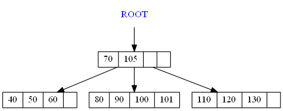

## Inserting 104:

## Inserting 103:

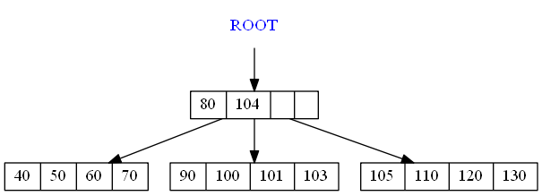

## Inserting 102:

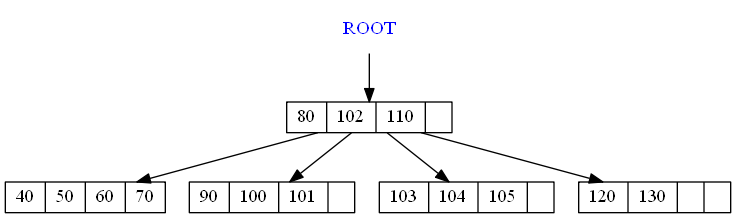

## Inserting 140:

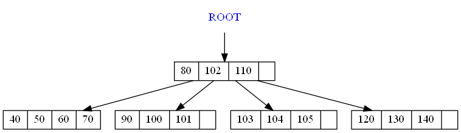

## Inserting 150:

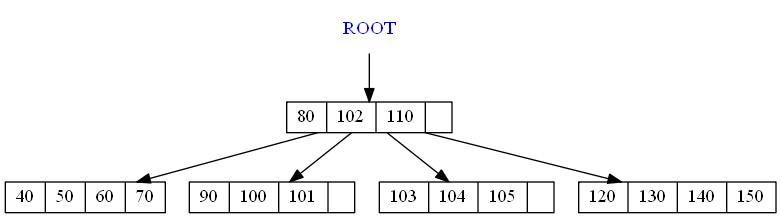

## Inserting 160:

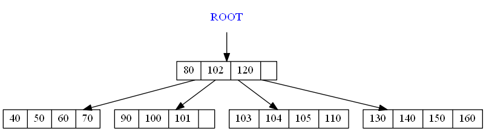

## Inserting 170:

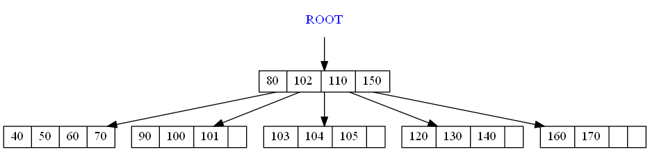

## Inserting 180:

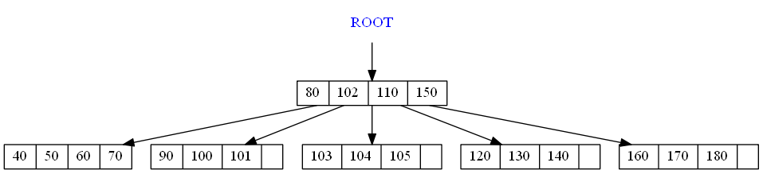

## Inserting 190:

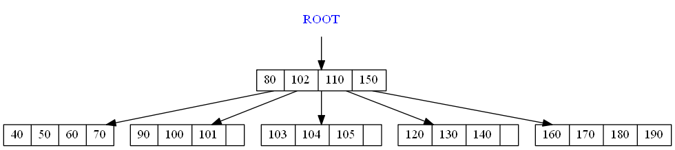

## Inserting 200:

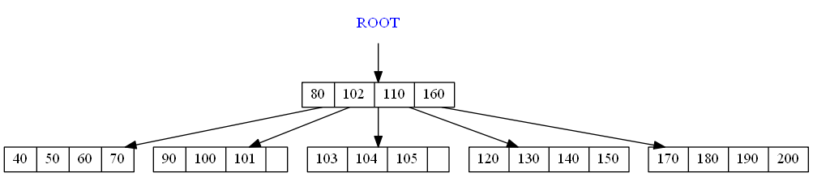

## Inserting 210:

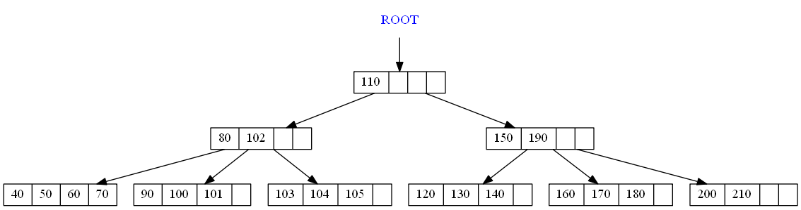

Removing samples: 
====================

## Initial:

## Removing 180:

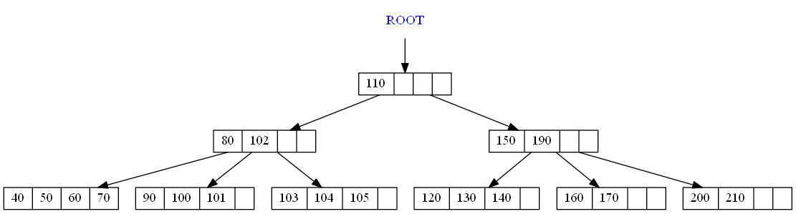

## Removing 170:

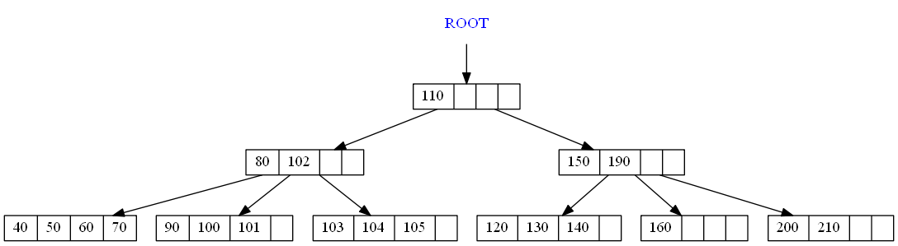

## Inserting 160:

## Removing 150:

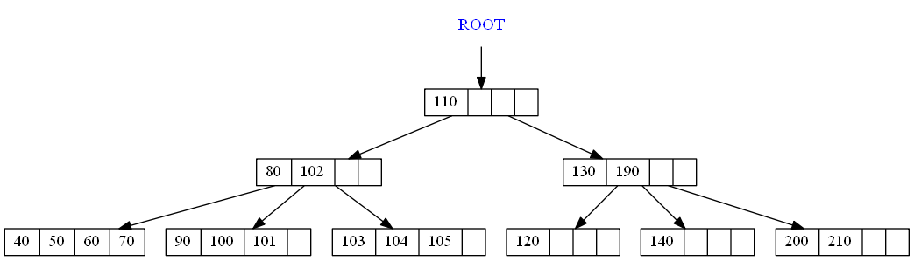

## Inserting 140:

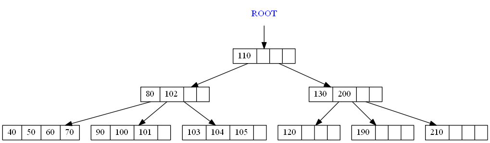

## Removing 190:

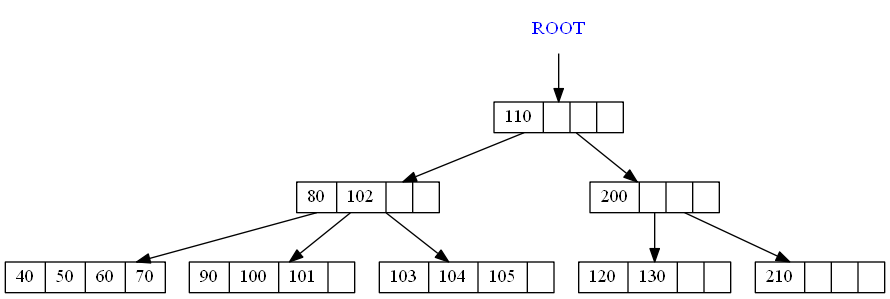

## Removing 130:

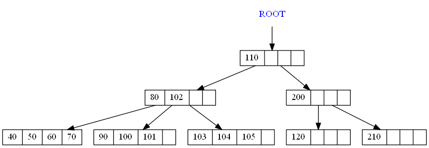

## Removing 210:

## Inserting 200:

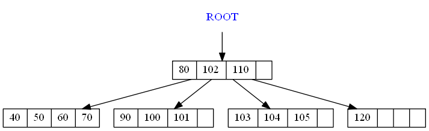

## Removing 120:

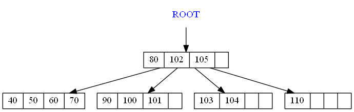

## Inserting 70:

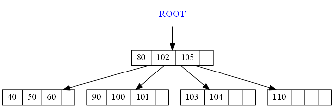

## Removing 60:

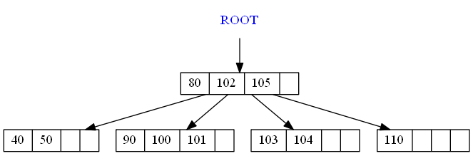

## Removing 50:

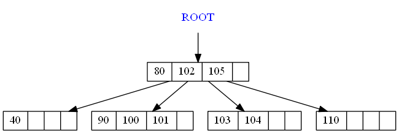

## Removing 40:

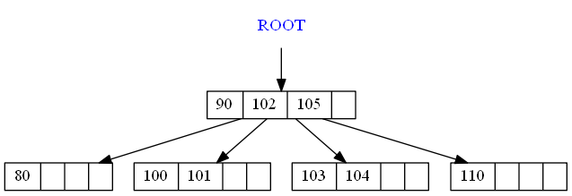

## Inserting 80:

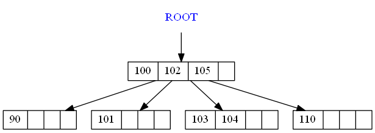

## Removing 90:

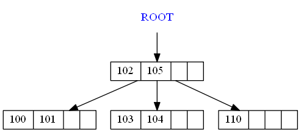

## Inserting 100:

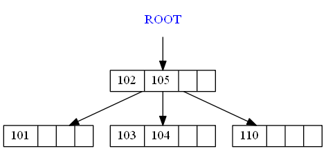

## Removing 101:

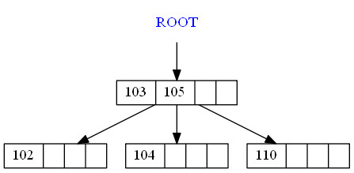

## Removing 102:

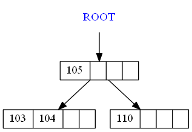

## Removing 110:

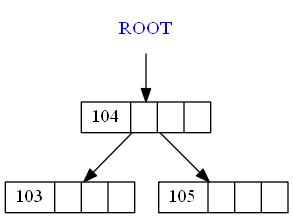

## Inserting 105:

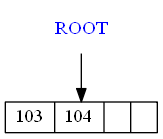

## Removing 104:

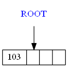

## Inserting 103:

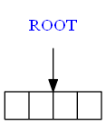
